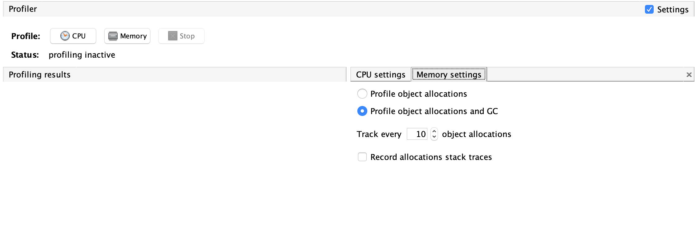

### First App: "The Lightweight City Retriever"

The Lightweight City Retriever application allows you to get information on any city you'd like, and fast!
It introduces a revolutionary cache mechanism that will save you plenty of time and network latency.

When a request for a city arrives, first we'll check if it exists in the cache. If it is still not in the cache, 
we'll call our remote and slow DB, cache the city and return it.

To test that it is working properly, let's fire up the server and see what happens

1. In your terminal navigate to `CityRetriever`, execute `./compile.sh` and `./run.sh`. Your Jetty server should be up and running.

2. In a separate terminal window, locate your PID via `jps`.

3. Open `jvisualvm` (From terminal), locate your app and go to the `Monitor` tab. 

4. Run `./create_load.sh` from terminal. It will create 10K requests. 
Each request will try to retrieve one of the first 10 cities (So eventually there should be no more than 10 cities in our cache)

5. Back to JVisualVM. You should see the Heap graph going wild. To investigate further, let's take a heap dump. In JVisualVM: `Monitor` tab -> `Heap dump` (right upper corner). 
Let's open the heap dump and look at the `Classes` tab. What is wrong here? 

6. Let's try to gather the "[Surviving Generations](https://blogs.oracle.com/nbprofiler/what-do-the-surviving-generations-metrics-mean)" metric: 
    1. Make sure the app is still running and retrieving cities
    2. Go to the `Profiler` tab and configure your setting as follows:
   
    3. Click on `Memory` to start profiling. Watch the `generations` metric. What are we seeing?

7. Kill the app. 

8. Let's try to simulate faster what will happen over time. Let's increase the rate of requests
(by simply looping infinitely) while decreasing the heap size.
Run `./fast_run.sh` - It will do that for you. Sooner or later, the app will crash.

9. Open the source code in your favorite IDE. (load the `pom.xml` in `/jvmworkshop`). Locate and try to fix the problem.

Solution [is here](solution/Solution.md)
