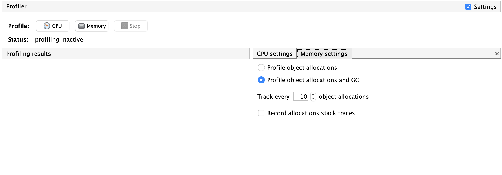

# [Workshop] Troubleshooting the JVM 

## Objectives & Toolbox

In today's workshop we will simulate common use cases of JVM problems you might run into when your application misbehaves.

We will learn how to troubleshoot and diagnose JVM issues in our application using a our toolbox below:

`jps` - JVM Process Status Tool. Allows you to find the PID of your running JVMs.

`jmap` - Memory Map. Allows you to take histograms and heapdumps.

`jstack` - Allows us to print the stack traces of all threads that are attached to our JVM (e.g. Thread dump)

`jvisualvm`  - Allows you to monitor and troubleshoot apps on the JVM.

All of them are already installed on your machine if you have JDK installed.

## Optional Installations

`Visual VM GC Plugin` - Install it via: Visual VM -> Tools -> Plugins

`MAT - Eclipse Memory Analyzer` - A feature-rich Java heap analyzer that allows you to analyze larger heap dumps easily (https://www.eclipse.org/mat/downloads.php)

## Let's Start!

Below you will find a list of sample apps. Simple, yet misbehaving apps. 

### "The Lightweight Contact Retriever"

The Lightweight Contact Retriever application allows you to get any contact you'd like, and fast!
It introduces a revolutionary cache mechanism that will save you plenty of time and network latency.

When a contact request arrives, if the contact is already in the cache we will extract it from there. Otherwise,
we'll call our remote and slow DB, cache the contact and return it.

To test that it is working properly, let's fire up the server and see what happens

1. In your terminal navigate to `ContactRetriever`, execute `/.compile.sh` and `./run.sh`. Your jetty server should be up and running.

2. In a separate terminal window, locate your PID via `jps`.

3. Open VisualVM, locate your app and monitor it. 

4. We created a shell script for you that will randomize contactIds from 1 to 10 and send the following HTTP call:
`curl http://localhost:8080?contactId=<contactNumber>` 
In order to generate load, run `./create_load.sh`. It will create 10K requests.

5. Back to VisualVM. What is happening? 
To investigate further, let's take a heap dump after a while. Take it via:
    * VisualVM
    * jmap. (By running `jmap -dump:live,file=<filename> <pid>`)  
Let's open the heap dump and look at the `Classes` tab. What is wrong here?  
6. Let's try to gather the "[Surviving Generations](https://blogs.oracle.com/nbprofiler/what-do-the-surviving-generations-metrics-mean)" metric: 
    1. Make sure the app is still running and creating contacts
    2. Go to `Profiler` tab and configure your setting as follows:
   
    3. Click on `Memory` to start profiling. Watch the `generations` metric. What are we seeing?

7. Shutdown the process. 

8. Let's try to simulate faster what will happen overtime. Let's increase the rate of requests
(by simply looping infinitely) while decreasing the heap size.
Run `./fast_run.sh` - It will do that for you. Let it run for a minute or two. What is happening?
In the meanwhile, open the source code in your favorite IDE. (load the `pom.xml` in `/jvmworkshop`). Locate and try to fix the problem.

Solution [is here](/ContactRetriever/solution/Solution.md)

### "The Always Correct Money Transfer" App
The Always Correct Money Transfer application allows you to safely and conveniently transfer money from one account to the other.
It is keep your account safe and will withdraw more money than it should.

To test that it is working properly, running our app will transfer 5$ from Foo account to Bar and 5$ from Bar account to Foo.
After completing it will print out the current balance of each account.

1. In your terminal navigate to `MoneyTransfer`, execute `/.compile.sh` and `./run.sh`. Your app is now running.
2. This time, take a thread dump via `jstack <PID>`
3. Investigate the results yourself or upload the results to https://fastthread.io
4. You figured out what went wrong, awesome! Open the source code and try to fix the problem (while keeping our app "Always correct"!)
5. Rerun the app and make sure it completes successfully.

Solution [is here](/MoneyTransfer/solution/Solution.md)

### "Airbnb Reviews Analyzer" App
The Airbnb Reviews Analyzer is an app that can read a CSV file that contains reviews on an Airbnb property, parse it
and figure out how many positive and negative reviews are there, using a super complex algorithm! 

To test that it is working properly, running our app will analyze only the first 3K reviews (out of ~200K reviews)

1. In your terminal navigate to `AirbnbReviews` execute `/.compile.sh` and `./run.sh`. 
2. Again, go to VisualVM. Can you see what is wrong?
3. Open the source code, understand the problem and mitigate it. 

Solution [is here](/AirbnbReviews/solution/Solution.md)

### "YouTube Likes Calculator" App
The YouTube Likes Calculator is an app that can read CSV files that contains data on youtube videos such as: views, likes reviews dates and more.
 
The app goes over the data and calculates the average likes for video per country.

1. In your terminal navigate to ??? a and run ???. Your app crashed.
2. Run it with a JVM flag to automatically take a heap dump on OOM.
3. Investigate the heap dump. 
4. Run the app again, this time with -Xmx???
5. Monitor it. Do you think there is a leak? (Solution is here ???)

Solution [is here](/LikesCalculator/solution/Solution.md)

### "SuperUUID Tokens Generator" App
The SuperUUID Tokens Generator App generates a REALLY long String that will represent the context id for
the scope of every request that will be made to the server. 
Obviously, the main requirement is that each request must have its own unique ID.

To test that it is working properly, Let's run the app and fire requests.
 
1. In your terminal navigate to `SuperUuidGenerator` and execute `/.compile.sh` and `./run.sh`. Your Server is now running
2. Run the `./create_load.sh` script. It will fire 100 requests while printing out their IDs.
3. What is wrong here?
4. Let's also investigate via VisualVM. This time, take a heap time, open it and navigate to "OQL Console"
5. Create a query to find out if there are long-lasting instances of the class that is holding our UUID (`com.wix.app5.model.SuperUuidWrapper`)
6. Open the source code, understand the problem and mitigate it. 

Solution [is here](/SuperUuidGenerator/solution/Solution.md)

## Reading Materials

