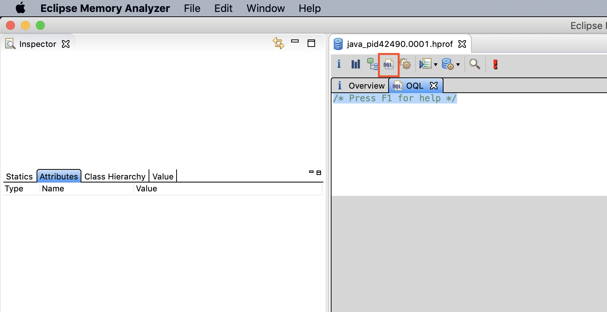

### Fourth App: "SuperUUID Tokens Generator"

#### Prerequisite
[Install](https://www.eclipse.org/mat/downloads.php) Eclipse Memory Analyzer - MAT 
___

The SuperUUID Tokens Generator App generates a very long String that will represent the context id for
the scope of every request that will be made to the server. 
The main requirement is that each request must have a unique ID.

To test that it is working properly, let's run the app and fire requests.
 
1. In your terminal navigate to `SuperUuidGenerator` and execute `/.compile.sh` and `./run.sh`. Your Server is now running
2. Run the `./create_load.sh` script. It will fire 100 requests while printing out their IDs.
3. Is the output valid? What is wrong here?
4. Let's take a heap dump using `jmap -dump:file=mydump.hprof <pid>`
5. Open the file you created with `MAT` (File -> Open heap dump). 
6. Navigate to the "Object Query Language" tab
 
7. [Create a query](http://cr.openjdk.java.net/~sundar/8022483/webrev.01/raw_files/new/src/share/classes/com/sun/tools/hat/resources/oqlhelp.html) 
to find out if there are instances that were not GCed of the class that is holding our UUID (`com.wix.app5.model.SuperUuidWrapper`)
8. Open the source code, understand the problem and mitigate it. 
9. Rerun the app to make sure that the issue is solved.

Solution [is here](solution/Solution.md)
